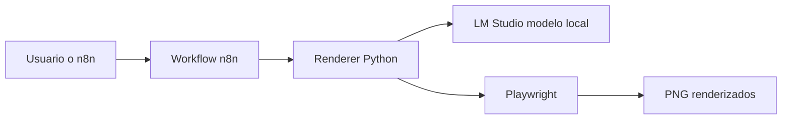

# designerCyberMinds

DesignerCyberMinds es una solución local-first para generar posts visuales de alto impacto para redes sociales, combinando automatización con IA multimodal y renderizado de slides en imágenes PNG.

La idea central del proyecto es simple pero poderosa: recibir un tema, un formato y una referencia visual, y convertirlo en un carrusel listo para publicar, con texto, composición editorial y assets renderizados automáticamente.

## ¿Qué hace este proyecto?

Este flujo permite:

- Crear diseños de contenido para Instagram, LinkedIn o otras plataformas.
- Generar múltiples slides a partir de un prompt de negocio o creatividad.
- Usar un modelo visual local vía LM Studio para comprender imágenes y producir HTML/CSS listo para renderizar.
- Transformar esos diseños en imágenes PNG utilizando Playwright.
- Integrar el proceso con n8n para automatizar workflows y conexiones externas.

## Visión general del stack

El proyecto está compuesto por varios módulos:

- n8n: orquesta la automatización y el flujo de trabajo.
- Python Renderer: genera el diseño, prepara el prompt y renderiza los slides.
- LM Studio: sirve el modelo local multimodal que interpreta texto e imágenes.
- Playwright: convierte el HTML generado en imágenes finales.
- Redis y Ngrok: apoyan la ejecución y exposición de eventos o webhooks.

## Arquitectura



## Características principales

- Diseño generado con enfoque editorial y visual fuerte.
- Soporte para imágenes de referencia y contenido visual del usuario.
- Exportación directa a archivos PNG para carruseles o posts.
- Configuración pensada para ejecutarse localmente en Windows.
- Preparado para trabajar con modelos visuales como Qwen 3.5 9B en LM Studio.

## Estructura del proyecto

```text
.
├── docker-compose.yml
├── .env
├── README.md
├── data/
│   └── n8n_shared_data/
├── python_renderer/
│   ├── Dockerfile
│   ├── render.py
│   └── requirements.txt
```

## Requisitos previos

Antes de arrancar el proyecto necesitas:

- Docker Desktop instalado y en ejecución.
- LM Studio instalado y corriendo en modo server.
- Un modelo visual descargado, por ejemplo: Qwen 3.5 9B.
- Acceso a la API local de LM Studio en el puerto 1234.

## Configuración rápida

1. Ajusta tus variables en el archivo .env.
2. Asegúrate de que LM Studio esté corriendo y accesible desde Docker.
3. Levanta los servicios:

```bash
docker compose up -d --build
```

4. El renderer quedará disponible en el puerto 8000.

## Flujo de trabajo

1. n8n recibe una solicitud de generación.
2. El renderer arma un prompt con contexto visual y textual.
3. LM Studio genera el contenido estructurado del diseño.
4. Playwright convierte cada slide en una imagen PNG.
5. Los archivos quedan listos para ser consumidos por el workflow o descargados.

## ¿Por qué este proyecto es interesante?

Porque combina tres cosas muy útiles:

- Automatización de contenido visual.
- IA local y privada.
- Generación de assets listos para publicar.

Eso lo hace ideal para equipos que quieren experimentar con marketing visual, branding, creatividad automatizada o producción de contenido con control local.

## Próximos pasos posibles

- Añadir más plantillas visuales y estilos predefinidos.
- Mejorar la generación de slides con reglas de diseño más estrictas.
- Integrar una capa de almacenamiento de resultados.
- Añadir más conectores de n8n para publicación directa.

## Nota

Este proyecto está pensado para funcionar de forma local y modular. Si quieres, en siguientes iteraciones se puede extender con una interfaz web, más modelos visuales o una experiencia más guiada para el usuario final.

